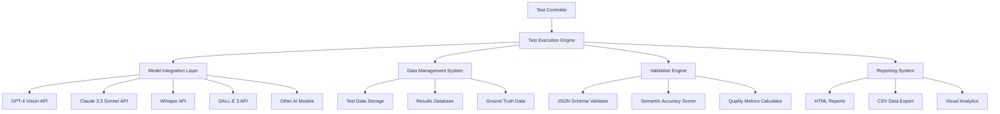

# Design Document

## Overview

The Core Technical Testing Framework is a comprehensive Python-based testing system that automates the execution and validation of semantic media compression tests. The framework implements the four core technical tests defined in the TESTS/01-core-technical directory, providing quantitative metrics, automated validation, and detailed reporting to validate theoretical claims about semantic compression technology.

## Architecture

### System Architecture



### Directory Structure

```
TESTS/
├── .env                        # Environment variables (API keys, settings)
├── venv/                       # Python virtual environment (gitignored)
├── setup.py                    # Easy setup script
├── run_tests.py               # Main test runner with CLI interface
└── 01-core-technical/
    ├── framework/              # Testing framework code
    │   ├── __init__.py
    │   ├── test_controller.py  # Main test orchestration
    │   ├── models/             # AI model integrations
    │   │   ├── __init__.py
    │   │   ├── base_model.py   # Abstract base class
    │   │   ├── gpt4_vision.py  # GPT-4 Vision integration
    │   │   ├── claude_sonnet.py # Claude 3.5 integration
    │   │   ├── whisper_model.py # Whisper integration
    │   │   └── generation_models.py # DALL-E, Midjourney, etc.
    │   ├── validators/          # Validation and scoring
    │   │   ├── __init__.py
    │   │   ├── semantic_validator.py
    │   │   ├── json_validator.py
    │   │   └── quality_scorer.py
    │   ├── data/               # Data management
    │   │   ├── __init__.py
    │   │   ├── data_manager.py
    │   │   └── result_storage.py
    │   └── reporting/          # Report generation
    │       ├── __init__.py
    │       ├── report_generator.py
    │       └── visualizations.py
    ├── test-data/              # Test content and ground truth
    │   ├── code-samples/       # Code test cases
    │   ├── ground-truth/       # Reference annotations
    │   └── schemas/            # JSON schema definitions
    ├── results/                # Test execution results
    │   ├── semantic-extraction/ # Test 01 results
    │   ├── json-generation/    # Test 02 results
    │   ├── content-regeneration/ # Test 03 results
    │   └── code-extraction/    # Test 04 results
    ├── config/                 # Configuration files
    │   ├── test_config.yaml   # Test parameters
    │   └── model_config.yaml  # AI model settings
    └── requirements.txt       # Python dependencies

video/                          # Video test files (in project root)
├── cultural-documentary.mp4
├── educational-tutorial.mp4
├── action-sequence.mp4
├── animation-simple.mp4
└── documentary-clip.mp4
```

## Components and Interfaces

### Test Controller

**Purpose**: Orchestrates test execution, manages configuration, and coordinates between components.

**Key Methods**:
- `execute_test_suite(test_id, config)`: Runs specified test with configuration
- `monitor_progress()`: Tracks execution progress and costs
- `handle_failures(error)`: Manages error conditions and recovery

**Configuration Interface**:
```python
@dataclass
class TestConfig:
    test_id: str
    models_to_test: List[str]
    budget_limit: float
    quality_thresholds: Dict[str, float]
    output_formats: List[str]
```

### Model Integration Layer

**Purpose**: Provides unified interface to different AI models with consistent error handling and cost tracking.

**Base Model Interface**:
```python
class BaseModel(ABC):
    @abstractmethod
    def extract_semantics(self, content: Any) -> Dict[str, Any]:
        """Extract semantic information from content"""
        pass
    
    @abstractmethod
    def generate_content(self, blueprint: Dict[str, Any]) -> Any:
        """Generate content from semantic blueprint"""
        pass
    
    @abstractmethod
    def get_cost_estimate(self, content_size: int) -> float:
        """Estimate processing cost"""
        pass
```

**GPT-4 Vision Integration**:
```python
class GPT4VisionModel(BaseModel):
    def __init__(self, api_key: str, cost_tracker: CostTracker):
        self.client = OpenAI(api_key=api_key)
        self.cost_tracker = cost_tracker
    
    def extract_semantics(self, video_path: str) -> Dict[str, Any]:
        # Implementation for video semantic extraction
        # Returns structured semantic data
        pass
```

### Validation Engine

**Purpose**: Validates test results against success criteria and calculates quality metrics.

**Semantic Accuracy Validator**:
```python
class SemanticValidator:
    def validate_extraction_accuracy(self, 
                                   extracted: Dict[str, Any], 
                                   ground_truth: Dict[str, Any]) -> float:
        """Calculate semantic extraction accuracy score (0-10)"""
        pass
    
    def validate_character_consistency(self, 
                                     scenes: List[Dict[str, Any]]) -> float:
        """Measure character consistency across scenes"""
        pass
```

**JSON Schema Validator**:
```python
class JSONValidator:
    def validate_schema_compliance(self, 
                                 json_data: Dict[str, Any], 
                                 schema: Dict[str, Any]) -> bool:
        """Validate JSON against schema with 100% compliance requirement"""
        pass
    
    def calculate_compression_ratio(self, 
                                  original_size: int, 
                                  compressed_size: int) -> float:
        """Calculate compression ratio"""
        pass
```

### Data Management System

**Purpose**: Manages test data, results storage, and historical tracking.

**Data Manager Interface**:
```python
class DataManager:
    def load_test_content(self, test_id: str) -> List[TestContent]:
        """Load test videos, code samples, and ground truth data"""
        pass
    
    def store_results(self, test_id: str, results: TestResults) -> None:
        """Store test results with timestamp and metadata"""
        pass
    
    def get_historical_data(self, test_id: str, 
                          date_range: Tuple[datetime, datetime]) -> List[TestResults]:
        """Retrieve historical test results for trend analysis"""
        pass
```

## Data Models

### Test Content Models

```python
@dataclass
class VideoTestContent:
    file_path: str
    genre: str
    duration: float
    cultural_context: str
    ground_truth_annotations: Dict[str, Any]

@dataclass
class CodeTestContent:
    file_path: str
    language: str
    complexity_level: str
    business_domain: str
    test_suite_path: str
```

### Result Models

```python
@dataclass
class SemanticExtractionResult:
    test_id: str
    model_name: str
    content_id: str
    extraction_data: Dict[str, Any]
    accuracy_score: float
    processing_time: float
    cost: float
    timestamp: datetime

@dataclass
class JSONGenerationResult:
    test_id: str
    model_name: str
    schema_type: str
    json_data: Dict[str, Any]
    schema_compliance: bool
    semantic_completeness: float
    compression_ratio: float
    timestamp: datetime
```

### Quality Metrics Models

```python
@dataclass
class QualityMetrics:
    character_consistency: float
    scene_coherence: float
    cultural_accuracy: float
    technical_quality: float
    overall_score: float
    
@dataclass
class TestSummary:
    test_id: str
    total_test_cases: int
    passed_cases: int
    average_scores: QualityMetrics
    cost_summary: CostSummary
    execution_time: float
```

## Error Handling

### API Error Management

```python
class APIErrorHandler:
    def handle_rate_limit(self, retry_after: int) -> None:
        """Handle API rate limiting with exponential backoff"""
        pass
    
    def handle_quota_exceeded(self) -> None:
        """Handle API quota exceeded errors"""
        pass
    
    def handle_model_unavailable(self, model_name: str) -> str:
        """Handle model unavailability by suggesting alternatives"""
        pass
```

### Cost Control System

```python
class CostController:
    def __init__(self, budget_limit: float):
        self.budget_limit = budget_limit
        self.current_spend = 0.0
    
    def check_budget_before_request(self, estimated_cost: float) -> bool:
        """Verify budget availability before making API calls"""
        pass
    
    def track_actual_cost(self, actual_cost: float) -> None:
        """Track actual API costs and update budget"""
        pass
```

## Testing Strategy

### Unit Testing

- **Model Integration Tests**: Verify each AI model integration works correctly
- **Validation Logic Tests**: Test accuracy scoring and quality metrics calculations
- **Data Management Tests**: Verify data loading, storage, and retrieval functions
- **Configuration Tests**: Test configuration loading and validation

### Integration Testing

- **End-to-End Test Execution**: Run complete test suites with mock AI responses
- **API Integration Tests**: Test actual AI model API calls with small test cases
- **Result Storage Tests**: Verify complete result storage and retrieval workflows
- **Report Generation Tests**: Test report generation with sample data

### Performance Testing

- **Cost Optimization Tests**: Verify cost tracking and budget controls work correctly
- **Concurrent Execution Tests**: Test parallel processing of multiple test cases
- **Large Dataset Tests**: Verify system handles large test datasets efficiently
- **Memory Usage Tests**: Monitor memory consumption during test execution

## Configuration Management

### Environment Configuration (.env in TESTS folder)

```bash
# TESTS/.env
# API Keys
OPENAI_API_KEY=your_openai_api_key_here
ANTHROPIC_API_KEY=your_anthropic_api_key_here
ELEVENLABS_API_KEY=your_elevenlabs_api_key_here

# Budget Controls
TOTAL_BUDGET=200.0
PER_TEST_BUDGET=50.0
WARNING_THRESHOLD=0.8

# Video File Paths (relative to project root)
VIDEO_FOLDER=video
TEST_VIDEO_COUNT=5

# Model Settings
GPT4_MAX_REQUESTS_PER_MINUTE=10
CLAUDE_MAX_REQUESTS_PER_MINUTE=15
```

### Test Configuration

```yaml
# config/test_config.yaml
test_suites:
  semantic_extraction:
    enabled: true
    models: ["gpt4_vision", "claude_sonnet"]
    accuracy_threshold: 0.75
    video_folder: "${VIDEO_FOLDER}"
  
  json_generation:
    enabled: true
    schema_types: ["hierarchical", "character_centric"]
    completeness_threshold: 0.85
    compression_ratio_target: 500
  
  content_regeneration:
    enabled: true
    models: ["dalle3", "midjourney", "stable_diffusion"]
    consistency_threshold: 0.80
    
  code_extraction:
    enabled: true
    languages: ["python", "javascript", "java"]
    equivalence_threshold: 0.95
```

### Easy Setup and Execution

**Setup Script (TESTS/setup.py)**:
```python
#!/usr/bin/env python3
"""Easy setup script for semantic compression testing framework"""

import os
import subprocess
import sys
from pathlib import Path

def setup_environment():
    """Set up virtual environment and install dependencies"""
    print("Setting up testing environment...")
    
    # Create virtual environment
    subprocess.run([sys.executable, "-m", "venv", "venv"])
    
    # Activate and install dependencies
    if os.name == 'nt':  # Windows
        pip_path = "venv/Scripts/pip"
    else:  # Unix/Linux/Mac
        pip_path = "venv/bin/pip"
    
    subprocess.run([pip_path, "install", "-r", "01-core-technical/requirements.txt"])
    
    # Create .env file if it doesn't exist
    env_file = Path(".env")
    if not env_file.exists():
        create_env_template()
    
    print("Setup complete! Please update .env file with your API keys.")

def create_env_template():
    """Create .env template file"""
    template = """# API Keys - Replace with your actual keys
OPENAI_API_KEY=your_openai_api_key_here
ANTHROPIC_API_KEY=your_anthropic_api_key_here
ELEVENLABS_API_KEY=your_elevenlabs_api_key_here

# Budget Controls
TOTAL_BUDGET=200.0
PER_TEST_BUDGET=50.0
WARNING_THRESHOLD=0.8

# Video Settings
VIDEO_FOLDER=video
TEST_VIDEO_COUNT=5
"""
    with open(".env", "w") as f:
        f.write(template)

if __name__ == "__main__":
    setup_environment()
```

**Main Test Runner (TESTS/run_tests.py)**:
```python
#!/usr/bin/env python3
"""Main test runner with CLI interface for semantic compression tests"""

import argparse
import sys
from pathlib import Path

# Add framework to path
sys.path.append(str(Path(__file__).parent / "01-core-technical"))

from framework.test_controller import TestController

def main():
    parser = argparse.ArgumentParser(description="Run semantic compression tests")
    parser.add_argument("--test", choices=["01", "02", "03", "04", "all"], 
                       default="all", help="Which test to run")
    parser.add_argument("--budget", type=float, help="Override budget limit")
    parser.add_argument("--models", nargs="+", help="Specific models to test")
    parser.add_argument("--report", action="store_true", help="Generate detailed report")
    parser.add_argument("--dry-run", action="store_true", help="Validate setup without running tests")
    
    args = parser.parse_args()
    
    controller = TestController()
    
    if args.dry_run:
        controller.validate_setup()
        return
    
    if args.test == "all":
        controller.run_all_tests(budget=args.budget, models=args.models)
    else:
        controller.run_single_test(args.test, budget=args.budget, models=args.models)
    
    if args.report:
        controller.generate_comprehensive_report()

if __name__ == "__main__":
    main()
```

This design provides a comprehensive, modular, and extensible framework for executing and validating the core technical tests while maintaining proper organization within the existing TESTS/01-core-technical directory structure. The framework uses a virtual environment for isolation, stores configuration in a centralized .env file, references video files from the project root, and provides easy setup and execution scripts.