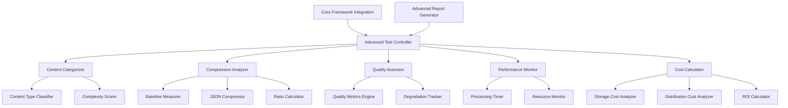

# Design Document

## Overview

The Advanced Validation Testing Framework extends the existing core technical testing infrastructure to provide sophisticated compression ratio analysis, quality degradation measurement, and cost-benefit analysis for semantic media compression. The system builds upon the proven architecture of the 01-core-technical framework while adding specialized components for advanced validation scenarios.

## Architecture

### High-Level Architecture



### System Integration

The framework integrates with the existing core technical testing infrastructure by:
- Extending the base TestController class
- Reusing existing model integrations and data management
- Leveraging established result storage and reporting systems
- Maintaining compatibility with the master test execution pipeline

## Components and Interfaces

### 1. Advanced Test Controller

**Purpose:** Orchestrates advanced validation tests with specialized progress tracking and cost monitoring.

**Key Methods:**
```python
class AdvancedTestController(TestController):
    def execute_compression_ratio_analysis(self, content_path: str) -> CompressionAnalysisResult
    def run_quality_degradation_tests(self, content_categories: List[str]) -> QualityAnalysisResult
    def perform_cost_benefit_analysis(self, results: List[TestResult]) -> CostBenefitReport
    def benchmark_content_categories(self, test_suite: str) -> BenchmarkReport
```

### 2. Content Categorizer

**Purpose:** Automatically categorizes video content and assigns complexity scores.

**Key Methods:**
```python
class ContentCategorizer:
    def classify_content_type(self, video_path: str) -> ContentType
    def calculate_complexity_score(self, video_metadata: VideoMetadata) -> float
    def extract_baseline_measurements(self, video_path: str) -> BaselineMeasurements
```

**Content Types:**
- DIALOGUE_HEAVY: Conversation-focused content with minimal visual complexity
- ACTION_SEQUENCES: High-motion content with rapid scene changes
- DOCUMENTARY: Educational content with mixed visual complexity
- ANIMATION: Stylized content with consistent visual patterns
- MUSIC_PERFORMANCE: Audio-focused content with performance visuals

### 3. Compression Analyzer

**Purpose:** Measures compression ratios and analyzes semantic JSON efficiency.

**Key Methods:**
```python
class CompressionAnalyzer:
    def measure_baseline_file_size(self, video_path: str) -> BaselineMetrics
    def generate_semantic_json(self, video_path: str, quality_level: QualityLevel) -> SemanticJSON
    def calculate_compression_ratio(self, original_size: int, compressed_size: int) -> float
    def analyze_json_size_factors(self, semantic_json: SemanticJSON) -> SizeAnalysis
```

### 4. Quality Assessor

**Purpose:** Evaluates semantic information preservation across compression levels.

**Key Methods:**
```python
class QualityAssessor:
    def measure_semantic_completeness(self, original: SemanticJSON, compressed: SemanticJSON) -> float
    def assess_cultural_accuracy(self, semantic_data: SemanticJSON) -> float
    def evaluate_narrative_coherence(self, semantic_data: SemanticJSON) -> float
    def check_character_consistency(self, semantic_data: SemanticJSON) -> float
```

**Quality Levels:**
- MAXIMUM_QUALITY: Minimal compression, maximum fidelity
- HIGH_QUALITY: Moderate compression, high fidelity
- STANDARD_QUALITY: Target compression, acceptable fidelity
- AGGRESSIVE_COMPRESSION: Maximum compression, minimum acceptable fidelity

### 5. Performance Monitor

**Purpose:** Tracks processing time, resource usage, and scalability metrics.

**Key Methods:**
```python
class PerformanceMonitor:
    def track_processing_time(self, operation: str) -> ProcessingTimer
    def monitor_resource_usage(self) -> ResourceMetrics
    def measure_scalability(self, content_sizes: List[int]) -> ScalabilityReport
    def identify_bottlenecks(self, performance_data: PerformanceData) -> BottleneckAnalysis
```

### 6. Cost Calculator

**Purpose:** Performs comprehensive cost-benefit analysis for storage and distribution.

**Key Methods:**
```python
class CostCalculator:
    def calculate_storage_savings(self, compression_ratio: float, storage_costs: StoragePricing) -> float
    def estimate_distribution_savings(self, compression_ratio: float, bandwidth_costs: BandwidthPricing) -> float
    def compute_processing_costs(self, api_usage: APIUsage, compute_resources: ComputeUsage) -> float
    def generate_roi_analysis(self, savings: CostSavings, investments: ProcessingCosts) -> ROIReport
```

## Data Models

### Core Data Structures

```python
@dataclass
class BaselineMeasurements:
    file_name: str
    duration_seconds: float
    resolution: Tuple[int, int]
    frame_rate: float
    audio_bitrate: int
    file_size_bytes: int
    content_type: ContentType
    complexity_score: float

@dataclass
class CompressionResult:
    original_size: int
    compressed_size: int
    compression_ratio: float
    quality_level: QualityLevel
    semantic_completeness: float
    processing_time: float

@dataclass
class QualityMetrics:
    semantic_completeness: float
    cultural_accuracy: float
    narrative_coherence: float
    character_consistency: float
    overall_quality_score: float

@dataclass
class CostBenefitAnalysis:
    storage_savings_annual: float
    distribution_savings_annual: float
    processing_costs_annual: float
    net_savings_annual: float
    roi_percentage: float
    break_even_months: int
```

### Configuration Schema

```yaml
advanced_validation:
  compression_targets:
    minimum_ratio: 200
    maximum_quality_loss: 0.10
    target_processing_time: 300  # seconds per video minute
  
  content_categories:
    - dialogue_heavy
    - action_sequences
    - documentary
    - animation
    - music_performance
  
  quality_levels:
    - maximum_quality
    - high_quality
    - standard_quality
    - aggressive_compression
  
  cost_analysis:
    storage_cost_per_gb_month: 0.023  # AWS S3 pricing
    bandwidth_cost_per_gb: 0.09       # CloudFront pricing
    processing_budget_limit: 1000.0   # USD
```

## Error Handling

### Error Categories

1. **Content Processing Errors**
   - Invalid video formats or corrupted files
   - Unsupported content types or codecs
   - Insufficient video quality for analysis

2. **Compression Analysis Errors**
   - JSON generation failures
   - Compression ratio calculation errors
   - Quality assessment failures

3. **Performance Monitoring Errors**
   - Resource monitoring failures
   - Timing measurement errors
   - Scalability test failures

4. **Cost Calculation Errors**
   - Pricing data unavailability
   - ROI calculation errors
   - Budget threshold violations

### Error Recovery Strategies

```python
class AdvancedValidationError(Exception):
    """Base exception for advanced validation errors"""
    pass

class ContentProcessingError(AdvancedValidationError):
    """Errors during content analysis and categorization"""
    pass

class CompressionAnalysisError(AdvancedValidationError):
    """Errors during compression ratio analysis"""
    pass

# Error handling with graceful degradation
def handle_content_processing_error(error: ContentProcessingError, content_path: str):
    # Log error and attempt alternative processing methods
    # Fall back to manual content categorization if needed
    # Continue with available data rather than failing completely
```

## Testing Strategy

### Unit Testing

1. **Component Testing**
   - Test each analyzer component independently
   - Mock external dependencies (video files, API calls)
   - Validate calculation accuracy with known test cases

2. **Integration Testing**
   - Test component interactions and data flow
   - Validate end-to-end compression analysis pipeline
   - Test error handling and recovery mechanisms

### Performance Testing

1. **Scalability Testing**
   - Test with various video sizes and durations
   - Measure performance degradation with increased load
   - Validate processing time targets

2. **Resource Usage Testing**
   - Monitor memory consumption during processing
   - Test CPU and GPU utilization patterns
   - Validate resource cleanup and management

### Validation Testing

1. **Accuracy Validation**
   - Compare compression ratios against manual calculations
   - Validate quality metrics against human assessments
   - Test cost calculations against actual pricing data

2. **Regression Testing**
   - Ensure compatibility with core framework updates
   - Validate consistent results across test runs
   - Test backward compatibility with existing test data

### Test Data Requirements

1. **Representative Content Samples**
   - 5-10 videos per content category
   - Various durations (30 seconds to 10 minutes)
   - Different resolutions and quality levels

2. **Ground Truth Data**
   - Manual quality assessments for validation
   - Known compression ratios for benchmark content
   - Cost calculation reference data

3. **Performance Benchmarks**
   - Processing time baselines
   - Resource usage patterns
   - Scalability thresholds