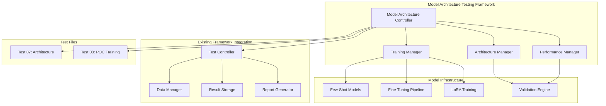

# Design Document

## Overview

The Model Architecture Testing Framework provides comprehensive testing capabilities for semantic compression model architectures, training approaches, and performance validation. The framework extends the existing 01-core-technical testing infrastructure to support model architecture validation, automated training pipelines, and comparative analysis of different semantic compression approaches.

The design integrates seamlessly with the existing testing framework while providing specialized capabilities for model architecture testing, including automated POC training approaches, semantic compression architecture validation, and comprehensive performance metrics collection.

## Architecture

### High-Level Architecture



### Component Integration

The framework follows the established patterns from the existing testing infrastructure:

1. **Controller Pattern**: `ModelArchitectureController` extends the existing `TestController` pattern
2. **Model Abstraction**: Leverages the existing `BaseModel` interface for consistent model interactions
3. **Data Management**: Uses the existing `DataManager` for test content loading and ground truth management
4. **Result Storage**: Integrates with existing `ResultStorage` for consistent result persistence
5. **Reporting**: Extends existing `ReportGenerator` for model architecture-specific reports

## Components and Interfaces

### ModelArchitectureController

```python
class ModelArchitectureController:
    """
    Main controller for model architecture testing operations.
    Orchestrates training approaches, architecture validation, and performance analysis.
    """
    
    def __init__(self, config_path: Optional[str] = None)
    def run_poc_training_test(self, approaches: List[str], budget: float) -> Dict[str, Any]
    def run_architecture_validation_test(self, architectures: List[str]) -> Dict[str, Any]
    def run_comprehensive_comparison(self) -> Dict[str, Any]
    def validate_setup(self) -> bool
```

### TrainingManager

```python
class TrainingManager:
    """
    Manages different training approaches for semantic compression models.
    Handles few-shot prompting, fine-tuning, and LoRA training pipelines.
    """
    
    def setup_few_shot_prompting(self, models: List[str]) -> bool
    def setup_fine_tuning_pipeline(self, model_type: str) -> bool
    def setup_lora_training(self, base_model: str) -> bool
    def execute_training_approach(self, approach: str, data: Dict[str, Any]) -> TrainingResult
    def compare_training_approaches(self, results: List[TrainingResult]) -> ComparisonReport
```

### ArchitectureManager

```python
class ArchitectureManager:
    """
    Manages semantic compression architecture testing and validation.
    Tests different model architectures for semantic extraction and compression.
    """
    
    def load_architecture_configs(self) -> List[ArchitectureConfig]
    def test_semantic_extraction(self, architecture: str, content: Any) -> ExtractionResult
    def test_compression_performance(self, architecture: str, content: Any) -> CompressionResult
    def validate_json_compliance(self, output: Dict[str, Any]) -> ValidationResult
    def measure_architecture_performance(self, architecture: str) -> PerformanceMetrics
```

### PerformanceManager

```python
class PerformanceManager:
    """
    Manages comprehensive performance metrics collection and analysis.
    Provides statistical analysis and comparative reporting capabilities.
    """
    
    def collect_performance_metrics(self, test_results: List[Any]) -> PerformanceMetrics
    def calculate_compression_ratios(self, original: Any, compressed: Any) -> float
    def measure_semantic_accuracy(self, predicted: Dict, ground_truth: Dict) -> float
    def generate_statistical_analysis(self, metrics: List[PerformanceMetrics]) -> StatisticalReport
    def create_comparison_matrix(self, approaches: List[str], metrics: List[PerformanceMetrics]) -> ComparisonMatrix
```

### Model Architecture Interfaces

#### Few-Shot Prompting Models

```python
class FewShotModel(BaseModel):
    """
    Extends BaseModel for few-shot prompting capabilities.
    Supports GPT-4, Claude, and Gemini models.
    """
    
    def setup_few_shot_examples(self, examples: List[Dict[str, Any]]) -> bool
    def generate_semantic_json(self, content: Any) -> ModelResponse
    def optimize_prompt_template(self, examples: List[Dict[str, Any]]) -> str
```

#### Fine-Tuning Pipeline

```python
class FineTuningPipeline:
    """
    Manages fine-tuning operations for T5 and FLAN-T5 models.
    Handles dataset preparation, training execution, and model validation.
    """
    
    def prepare_training_dataset(self, examples: List[Dict[str, Any]]) -> TrainingDataset
    def setup_training_configuration(self, model_type: str) -> TrainingConfig
    def execute_training(self, dataset: TrainingDataset, config: TrainingConfig) -> TrainingResult
    def validate_trained_model(self, model: Any, test_data: List[Dict[str, Any]]) -> ValidationResult
```

#### LoRA Training Pipeline

```python
class LoRATrainingPipeline:
    """
    Manages LoRA (Low-Rank Adaptation) training for efficient model fine-tuning.
    Supports LLaMA and Mistral base models with LoRA adapters.
    """
    
    def setup_lora_configuration(self, base_model: str) -> LoRAConfig
    def prepare_efficient_dataset(self, examples: List[Dict[str, Any]]) -> LoRADataset
    def execute_lora_training(self, config: LoRAConfig, dataset: LoRADataset) -> LoRAResult
    def merge_lora_adapter(self, base_model: Any, adapter: Any) -> Any
```

## Data Models

### Training Result Models

```python
@dataclass
class TrainingResult:
    approach: str
    model_name: str
    training_time: float
    training_cost: float
    validation_metrics: Dict[str, float]
    json_compliance_rate: float
    semantic_accuracy: float
    processing_speed: float
    error_log: List[str]
    timestamp: datetime

@dataclass
class ArchitectureConfig:
    name: str
    model_type: str
    parameters: Dict[str, Any]
    hardware_requirements: Dict[str, Any]
    expected_performance: Dict[str, float]

@dataclass
class PerformanceMetrics:
    json_compliance: float
    semantic_accuracy: float
    processing_speed: float
    cost_per_video: float
    compression_ratio: float
    cultural_sensitivity: float
    consistency_score: float
    confidence_intervals: Dict[str, Tuple[float, float]]
```

### Test File Structure Models

```python
@dataclass
class ModelArchitectureTest:
    test_id: str
    test_name: str
    description: str
    objectives: List[str]
    success_criteria: Dict[str, float]
    execution_steps: List[ExecutionStep]
    expected_deliverables: List[str]

@dataclass
class ExecutionStep:
    step_number: int
    description: str
    estimated_time: float
    required_resources: List[str]
    success_metrics: Dict[str, float]
    dependencies: List[str]
```

## Error Handling

### Training Pipeline Error Handling

```python
class TrainingError(Exception):
    """Base exception for training-related errors"""
    pass

class ModelLoadingError(TrainingError):
    """Raised when model loading fails"""
    pass

class DataPreparationError(TrainingError):
    """Raised when training data preparation fails"""
    pass

class TrainingExecutionError(TrainingError):
    """Raised when training execution fails"""
    pass

class ValidationError(TrainingError):
    """Raised when model validation fails"""
    pass
```

### Error Recovery Strategies

1. **Model Loading Failures**: Fallback to alternative model configurations
2. **Training Data Issues**: Automatic data cleaning and validation
3. **Training Execution Failures**: Checkpoint recovery and resume capabilities
4. **Validation Failures**: Alternative validation metrics and thresholds
5. **Resource Constraints**: Dynamic resource allocation and optimization

## Testing Strategy

### Unit Testing

```python
# Test individual components
class TestTrainingManager:
    def test_few_shot_setup(self)
    def test_fine_tuning_pipeline(self)
    def test_lora_configuration(self)

class TestArchitectureManager:
    def test_semantic_extraction(self)
    def test_compression_performance(self)
    def test_json_validation(self)

class TestPerformanceManager:
    def test_metrics_collection(self)
    def test_statistical_analysis(self)
    def test_comparison_generation(self)
```

### Integration Testing

```python
# Test component interactions
class TestModelArchitectureIntegration:
    def test_end_to_end_poc_training(self)
    def test_architecture_validation_pipeline(self)
    def test_performance_comparison_workflow(self)
    def test_existing_framework_integration(self)
```

### Performance Testing

```python
# Test performance characteristics
class TestPerformanceCharacteristics:
    def test_training_speed_benchmarks(self)
    def test_memory_usage_optimization(self)
    def test_concurrent_training_handling(self)
    def test_large_dataset_processing(self)
```

### Test File Implementation

#### Test 07: Semantic Compression Architecture

- **Objective**: Validate different model architectures for semantic extraction and compression
- **Scope**: Architecture comparison, performance benchmarking, compression ratio analysis
- **Success Criteria**: >80% semantic accuracy, >200:1 compression ratio, <5 minutes processing time
- **Implementation**: Automated architecture testing with comprehensive metrics collection

#### Test 08: POC Training Approaches

- **Objective**: Compare few-shot prompting, fine-tuning, and LoRA training approaches
- **Scope**: Training pipeline validation, cost-benefit analysis, performance comparison
- **Success Criteria**: >95% JSON compliance, >75% semantic completeness, <$1.00 per video
- **Implementation**: Automated training execution with statistical comparison analysis

## Implementation Phases

### Phase 1: Framework Foundation (Week 1)
1. Create missing test files (07-semantic-compression-architecture.md)
2. Implement ModelArchitectureController with basic functionality
3. Set up integration with existing TestController
4. Create basic TrainingManager with few-shot prompting support

### Phase 2: Training Infrastructure (Week 2)
1. Implement complete TrainingManager with all three approaches
2. Set up LoRA training pipeline with GPU optimization
3. Create ArchitectureManager for semantic extraction testing
4. Implement automated model loading and validation

### Phase 3: Performance Analysis (Week 3)
1. Implement PerformanceManager with comprehensive metrics
2. Create statistical analysis and comparison capabilities
3. Set up automated report generation
4. Integrate with existing reporting infrastructure

### Phase 4: Testing and Validation (Week 4)
1. Implement comprehensive test suite
2. Create automated execution scripts
3. Validate integration with existing framework
4. Perform end-to-end testing and optimization

## Integration Points

### Existing Framework Integration

1. **TestController Extension**: ModelArchitectureController inherits from TestController patterns
2. **Model Interface Compliance**: All training models implement BaseModel interface
3. **Data Management**: Uses existing DataManager for content loading and ground truth management
4. **Result Storage**: Integrates with existing ResultStorage for consistent data persistence
5. **Reporting**: Extends existing ReportGenerator for model architecture-specific reports

### Configuration Integration

```python
# Extends existing configuration structure
class ModelArchitectureConfig:
    training_approaches: List[str]
    model_architectures: List[str]
    performance_thresholds: Dict[str, float]
    hardware_requirements: Dict[str, Any]
    budget_limits: Dict[str, float]
```

### Execution Integration

```python
# Integrates with existing test execution pipeline
def run_model_architecture_tests(test_ids: List[str]) -> Dict[str, Any]:
    controller = ModelArchitectureController()
    return controller.run_tests(test_ids, budget=200.0)
```