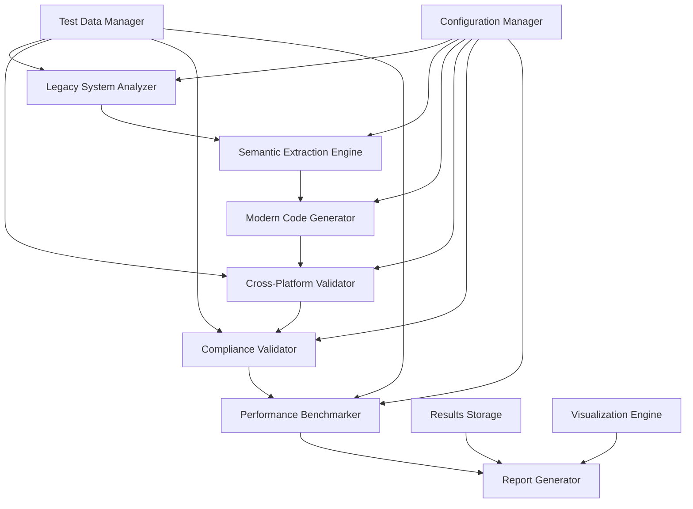

# Design Document

## Overview

The Practical Validation Testing Framework is designed to comprehensively validate semantic compression's ability to modernize legacy enterprise systems while preserving business logic, ensuring regulatory compliance, and demonstrating measurable improvements in development efficiency. The framework provides automated testing capabilities, comprehensive validation metrics, and detailed reporting to demonstrate practical enterprise value.

The framework follows a modular architecture with specialized components for legacy system analysis, semantic extraction validation, modern code generation testing, cross-platform consistency validation, and comprehensive reporting. It integrates with the existing TESTS infrastructure and leverages the legacy-code-base-example as a realistic test subject.

## Architecture

### High-Level Architecture



### Component Architecture

The framework consists of eight primary components:

1. **Legacy System Analyzer**: Analyzes existing legacy codebases to extract business logic, identify technical debt, and document system characteristics
2. **Semantic Extraction Engine**: Validates the accuracy of semantic blueprint generation from legacy systems
3. **Modern Code Generator**: Generates modern implementations from semantic blueprints and validates code quality
4. **Cross-Platform Validator**: Tests functional equivalence across multiple technology platforms
5. **Compliance Validator**: Ensures regulatory and business compliance requirements are preserved
6. **Performance Benchmarker**: Measures and compares performance characteristics between legacy and modern systems
7. **Report Generator**: Creates comprehensive reports for technical and business stakeholders
8. **Test Orchestrator**: Coordinates test execution and manages the overall validation workflow

## Components and Interfaces

### Legacy System Analyzer

**Purpose**: Analyzes legacy codebases to extract business logic, identify patterns, and document system characteristics.

**Key Interfaces**:
```python
class LegacySystemAnalyzer:
    def analyze_codebase(self, codebase_path: str) -> SystemAnalysis
    def extract_business_logic(self, analysis: SystemAnalysis) -> List[BusinessRule]
    def identify_technical_debt(self, analysis: SystemAnalysis) -> TechnicalDebtReport
    def generate_complexity_metrics(self, analysis: SystemAnalysis) -> ComplexityMetrics
```

**Responsibilities**:
- Parse Java EE, .NET, COBOL, and other legacy codebases
- Identify business logic patterns and extract semantic meaning
- Document technical debt and modernization opportunities
- Generate baseline metrics for comparison

### Semantic Extraction Engine

**Purpose**: Validates the accuracy and completeness of semantic blueprint generation from legacy systems.

**Key Interfaces**:
```python
class SemanticExtractionEngine:
    def validate_extraction_accuracy(self, legacy_code: str, semantic_blueprint: dict) -> ValidationResult
    def test_business_rule_preservation(self, rules: List[BusinessRule], blueprint: dict) -> ComplianceResult
    def verify_edge_case_coverage(self, test_cases: List[TestCase], blueprint: dict) -> CoverageResult
    def validate_regulatory_compliance(self, compliance_rules: List[ComplianceRule], blueprint: dict) -> ComplianceReport
```

**Responsibilities**:
- Validate semantic blueprint accuracy against original business logic
- Ensure all business rules are correctly captured
- Verify edge cases and error conditions are preserved
- Validate regulatory and compliance requirements

### Modern Code Generator

**Purpose**: Generates modern implementations from semantic blueprints and validates code quality.

**Key Interfaces**:
```python
class ModernCodeGenerator:
    def generate_spring_boot_implementation(self, blueprint: dict) -> GeneratedCode
    def generate_nodejs_implementation(self, blueprint: dict) -> GeneratedCode
    def generate_dotnet_core_implementation(self, blueprint: dict) -> GeneratedCode
    def validate_code_quality(self, generated_code: GeneratedCode) -> QualityMetrics
    def generate_test_suites(self, blueprint: dict, target_platform: str) -> TestSuite
```

**Responsibilities**:
- Generate modern implementations for multiple platforms
- Ensure generated code follows best practices and patterns
- Create comprehensive test suites for validation
- Validate code quality and maintainability metrics

### Cross-Platform Validator

**Purpose**: Tests functional equivalence and consistency across multiple technology platforms.

**Key Interfaces**:
```python
class CrossPlatformValidator:
    def execute_equivalence_tests(self, implementations: Dict[str, GeneratedCode]) -> EquivalenceResult
    def validate_business_logic_consistency(self, test_data: TestDataSet) -> ConsistencyResult
    def measure_platform_performance(self, implementations: Dict[str, GeneratedCode]) -> PerformanceComparison
    def validate_api_compatibility(self, implementations: Dict[str, GeneratedCode]) -> CompatibilityResult
```

**Responsibilities**:
- Execute identical test suites across all platforms
- Validate functional equivalence of business logic
- Measure and compare performance characteristics
- Ensure API compatibility and data consistency

### Compliance Validator

**Purpose**: Ensures regulatory and business compliance requirements are preserved during modernization.

**Key Interfaces**:
```python
class ComplianceValidator:
    def validate_regulatory_compliance(self, legacy_system: SystemAnalysis, modern_system: GeneratedCode) -> ComplianceReport
    def test_audit_trail_preservation(self, test_scenarios: List[AuditScenario]) -> AuditValidationResult
    def validate_security_controls(self, security_requirements: List[SecurityRequirement]) -> SecurityValidationResult
    def test_data_privacy_compliance(self, privacy_requirements: List[PrivacyRequirement]) -> PrivacyValidationResult
```

**Responsibilities**:
- Validate preservation of regulatory compliance requirements
- Ensure audit trails and logging are maintained
- Verify security controls and data protection measures
- Test privacy compliance and data handling procedures

### Performance Benchmarker

**Purpose**: Measures and compares performance characteristics between legacy and modern systems.

**Key Interfaces**:
```python
class PerformanceBenchmarker:
    def benchmark_legacy_system(self, system: SystemAnalysis, test_scenarios: List[PerformanceScenario]) -> PerformanceMetrics
    def benchmark_modern_system(self, system: GeneratedCode, test_scenarios: List[PerformanceScenario]) -> PerformanceMetrics
    def compare_performance_metrics(self, legacy_metrics: PerformanceMetrics, modern_metrics: PerformanceMetrics) -> PerformanceComparison
    def generate_scalability_analysis(self, systems: List[GeneratedCode]) -> ScalabilityReport
```

**Responsibilities**:
- Execute comprehensive performance benchmarks
- Compare response times, throughput, and resource utilization
- Analyze scalability characteristics and bottlenecks
- Generate performance improvement recommendations

### Report Generator

**Purpose**: Creates comprehensive reports for technical and business stakeholders.

**Key Interfaces**:
```python
class ReportGenerator:
    def generate_technical_report(self, validation_results: ValidationResults) -> TechnicalReport
    def generate_business_report(self, efficiency_metrics: EfficiencyMetrics) -> BusinessReport
    def generate_executive_summary(self, all_results: ComprehensiveResults) -> ExecutiveSummary
    def create_visualizations(self, metrics: Dict[str, Any]) -> List[Visualization]
```

**Responsibilities**:
- Generate detailed technical validation reports
- Create business-focused efficiency and ROI reports
- Produce executive summaries with key findings
- Create visualizations and charts for data presentation

## Data Models

### Core Data Structures

```python
@dataclass
class SystemAnalysis:
    codebase_path: str
    technology_stack: TechnologyStack
    business_rules: List[BusinessRule]
    technical_debt: TechnicalDebtReport
    complexity_metrics: ComplexityMetrics
    compliance_requirements: List[ComplianceRequirement]

@dataclass
class BusinessRule:
    rule_id: str
    description: str
    implementation_location: str
    business_logic: str
    test_cases: List[TestCase]
    regulatory_references: List[str]

@dataclass
class GeneratedCode:
    platform: str
    source_code: str
    test_suite: TestSuite
    quality_metrics: QualityMetrics
    performance_characteristics: PerformanceCharacteristics

@dataclass
class ValidationResult:
    test_name: str
    status: ValidationStatus
    accuracy_score: float
    discrepancies: List[Discrepancy]
    recommendations: List[str]

@dataclass
class PerformanceMetrics:
    response_time_ms: float
    throughput_rps: float
    memory_usage_mb: float
    cpu_utilization_percent: float
    scalability_score: float
```

### Test Data Models

```python
@dataclass
class TestScenario:
    scenario_id: str
    description: str
    input_data: Dict[str, Any]
    expected_output: Dict[str, Any]
    test_type: TestType
    priority: Priority

@dataclass
class TestSuite:
    suite_name: str
    platform: str
    test_cases: List[TestCase]
    coverage_metrics: CoverageMetrics
    execution_results: List[TestResult]

@dataclass
class ComplianceRequirement:
    requirement_id: str
    regulatory_framework: str
    description: str
    validation_criteria: List[str]
    test_scenarios: List[TestScenario]
```

## Error Handling

### Error Classification

The framework implements a comprehensive error handling strategy with four error categories:

1. **System Errors**: Infrastructure failures, file system issues, network problems
2. **Validation Errors**: Business logic discrepancies, compliance violations, test failures
3. **Generation Errors**: Code generation failures, template issues, platform-specific problems
4. **Performance Errors**: Benchmark failures, timeout issues, resource constraints

### Error Handling Strategy

```python
class ValidationError(Exception):
    def __init__(self, error_type: ErrorType, message: str, context: Dict[str, Any]):
        self.error_type = error_type
        self.message = message
        self.context = context
        self.timestamp = datetime.now()
        self.severity = self._determine_severity()

class ErrorHandler:
    def handle_validation_error(self, error: ValidationError) -> ErrorResponse
    def log_error_details(self, error: ValidationError) -> None
    def generate_error_report(self, errors: List[ValidationError]) -> ErrorReport
    def suggest_remediation(self, error: ValidationError) -> List[str]
```

### Recovery Mechanisms

- **Graceful Degradation**: Continue testing with reduced functionality when non-critical components fail
- **Retry Logic**: Automatic retry for transient failures with exponential backoff
- **Fallback Strategies**: Alternative validation approaches when primary methods fail
- **Error Aggregation**: Collect and report multiple errors for comprehensive analysis

## Testing Strategy

### Test Categories

1. **Unit Tests**: Individual component functionality validation
2. **Integration Tests**: Component interaction and data flow validation
3. **End-to-End Tests**: Complete workflow validation from legacy analysis to report generation
4. **Performance Tests**: Framework performance and scalability validation
5. **Regression Tests**: Ensure framework stability across updates

### Test Data Management

```python
class TestDataManager:
    def generate_synthetic_legacy_code(self, complexity_level: ComplexityLevel) -> str
    def create_test_scenarios(self, business_domain: BusinessDomain) -> List[TestScenario]
    def load_reference_implementations(self, platform: str) -> ReferenceImplementation
    def validate_test_data_quality(self, test_data: TestDataSet) -> QualityReport
```

### Validation Approaches

- **Golden Master Testing**: Compare outputs against known-good reference implementations
- **Property-Based Testing**: Validate system properties and invariants across different inputs
- **Mutation Testing**: Verify test suite effectiveness by introducing controlled changes
- **Differential Testing**: Compare behavior between legacy and modern implementations

## Implementation Phases

### Phase 1: Core Framework (Weeks 1-4)
- Implement Legacy System Analyzer for Java EE systems
- Create Semantic Extraction Engine with basic validation
- Develop Modern Code Generator for Spring Boot
- Build basic Test Orchestrator and reporting

### Phase 2: Cross-Platform Support (Weeks 5-8)
- Extend Modern Code Generator for Node.js and .NET Core
- Implement Cross-Platform Validator
- Add comprehensive test suite generation
- Enhance reporting with cross-platform metrics

### Phase 3: Compliance and Performance (Weeks 9-12)
- Implement Compliance Validator with regulatory frameworks
- Build Performance Benchmarker with comprehensive metrics
- Add security validation capabilities
- Create advanced visualization and reporting

### Phase 4: Integration and Optimization (Weeks 13-16)
- Integrate with existing TESTS infrastructure
- Optimize performance and scalability
- Add advanced error handling and recovery
- Complete comprehensive documentation and examples

This design provides a robust, scalable framework for validating semantic compression's practical value in enterprise legacy system modernization while ensuring comprehensive testing coverage and detailed reporting capabilities.